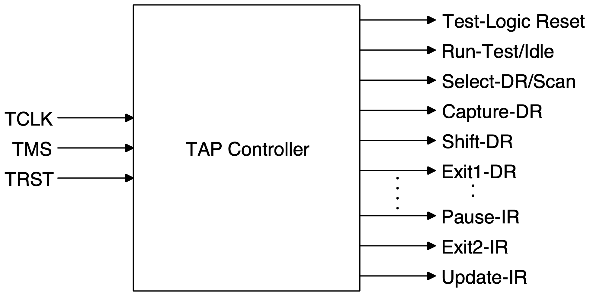

# TAP-Controller

The Test Access Port (TAP) is the interface used for JTAG control.

## Controller

The TAP controller controls the JTAG operation. It is a 16-state finite state machine (FSM) controlled by the Test Mode Select (TMS) signal. The state changes occur at rising edge of the Test Clock (TCLK).

The input ports of the controller are:
1. Test Clock (TCLK) - Clocks the registers
1. Test Mode Select (TMS) - Controls TAP controller state transitions
1. Test Reset (TRST) - Resets TAP Controller

There are 16 output ports of the controller signifying each state of the FSM.



## Implementation

The main TAP controller module is defined in `tap.v`. `test.v` is a testbench which checks against a basic test set which checks if the module is functional. `test_extensive.v` is a testbench which checks against an extensive test set which checks if the functioning of the controller for each state and each possible state transition.

## Testing

To test the working of `tap.v`

```bash
iverilog test.v
./a.out
```

For complete testing of all states and state transitions
```bash
iverilog test_extensive.v
./a.out
```
